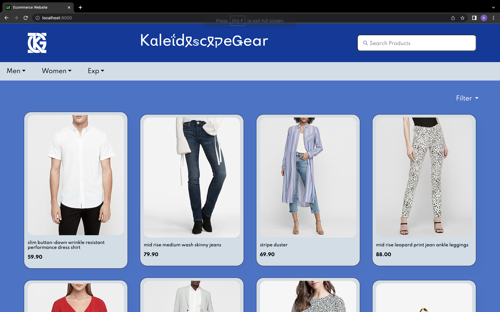
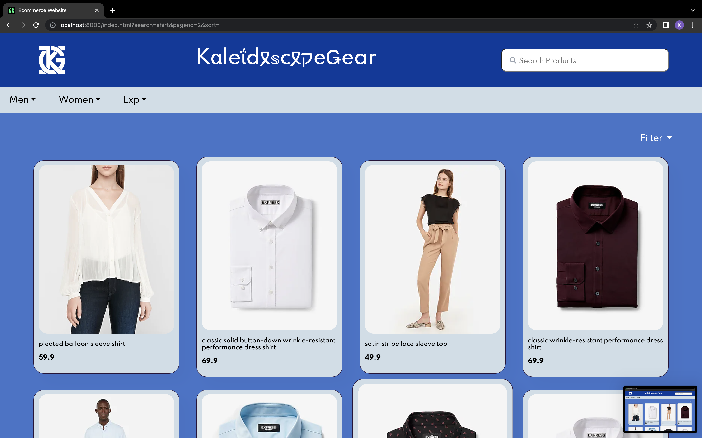
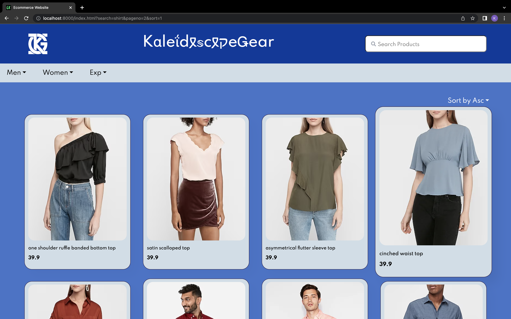
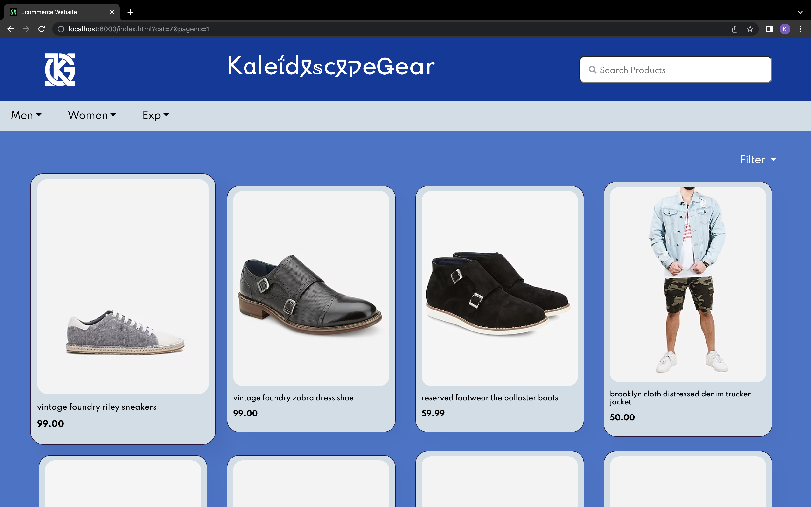

# Assignment
E-commerce website that can be deployed on Kubernetes with a HTML,Javascript,CSS frontend and Flask for backend. 
The data ingestion API that is created will be capable of taking in data from the merchandiser and adding it to the 
database after it has been validated


## Overview of API Specification 
We have designed api specification on two things
- Data Ingestion
   This is used to populate the products and category to thhe database on the respective json file provided.<br>
   The various api specification is mentioned below
   - Api to load the products into database via a post request
     ```
     POST   /products
     Host: localhost
     Content-Type :application/json
     Content Length: 
     { - - - -  JSON of Products - - - - }
     ```
   - Api to load the caetogory into database via a post request
      ```
      POST   /category
      Host: localhost
      Content-Type :application/json
      Content Length: 
      { - - - -  JSON of Products - - - - }
      ```
- Data Query
   This is used to perform some operation to fetched data from databse via a get request.<br>
   The various api specification is mentioned below.
   - To answer a query that has been passed. This will then be routed to Unbxd Search API
      ```
      GET     /products/search/<pagenumber>?query=”<query_name>”&sort=”1or2”
      Host: localhost
      Parameters: query,pagenumber
      ```
   - To perform category filtering
      ```
      GET   products/category/<pagenumber>?catid=”<catid>”&sort”1or2”
      Host: localhost
      Parameters: catid,sort,pagenumber
      ```
    - To get items that we want to load when site is first opened
      ```
      GET     /products/trending/<pagenumber>
      Host: localhost
      Parameters: pagenumber
      ```
    - To load the category tree on the basis of the level passed to it 
       ```
       GET /products/categorytree/?catid=”<catid>”
       Host: localhost
       Parameters:id
       ```
    -  To get the detailed product information
      ```
      GET /products/details/{productId}
      Host: localhost
      Parameters: id
      ```
Link to Postman collection 
(https://galactic-trinity-324064.postman.co/workspace/My-Workspace~6df70b9a-8926-4176-815a-c502ca40f285/collection/25320455-42651878-3c51-40a5-ab82-a52b28a98ba2?action=share&creator=25320455)

## How to run data ingestion API

DataIngestion folder consists of the data ingestion API, which will be run using curl commands. The below curl commamnds have to be run when inside DataIngestion folder. 

  ```curl 127.0.0.1:6000/category -d @category.json -H 'Content-Type:application/json```<br>
  ```curl 127.0.0.1:6000/products -d @out.json -H 'Content-Type:application/json'```


## How to run website
This would be run on docker using `docker-compose up -d --build` while inside the project directory. The frontend will be running on port 6000. 


## Screenshots of Application

### HomePage - Displaying Trending Products


### HomePage - Displaying Searched Products


### HomePage - Displaying Prducts With Filter Applied


### HomePage - Displaying Products With Category Applied


### ProductDetailPage - Displaying details of products

