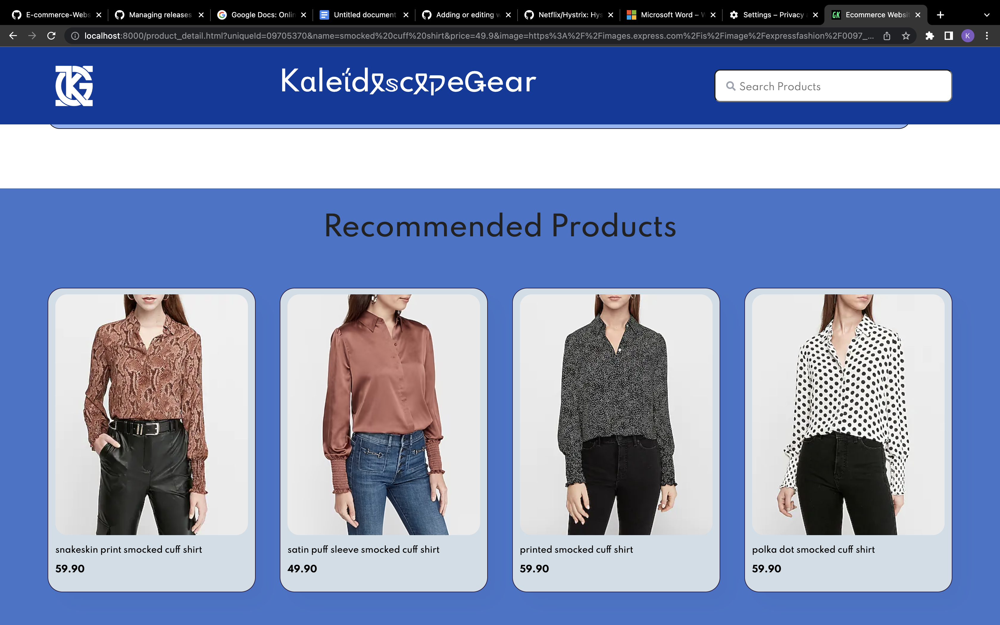

<h1>Kαleΐd𐍉𝕤c𐍉קeǤear 🔮🌀</h1>
E-commerce website that can be deployed on Kubernetes with a HTML,Javascript,CSS frontend and Flask for backend. 
The data ingestion API that is created will be capable of taking in data from the merchandiser and adding it to the 
database after it has been validated

## Design Document 📄🎨
Link to Design Document:<br>
https://docs.google.com/document/d/1RywhKonp1iKxGXmWKmwi7_Gw80758X-sdcvoyJN6cyQ/edit?usp=sharing

## Functional Documentation
Please refer to the wiki tab for detailed documentation of functions written in backend.

## Overview of API Specification 🤖💬
We have designed api specification on two things
- **Data Ingestion ⬇️🔄💾** <br>
   This is used to populate the products and category to thhe database on the respective json file provided.<br>
   The various api specification is mentioned below
   - Api to load the products into database via a post request 🛍️
     ```
     POST   /products
     Host: localhost
     Content-Type :application/json
     Content Length: 
     { - - - -  JSON of Products - - - - }
     ```
   - Api to load the caetogory into database via a post request 🏷️
      ```
      POST   /category
      Host: localhost
      Content-Type :application/json
      Content Length: 
      { - - - -  JSON of Products - - - - }
      ```
- **Data Query 🔍💻** <br>
   This is used to perform some operation to fetched data from databse via a get request.<br>
   The various api specification is mentioned below.
   - To answer a query that has been passed. This will then be routed to Unbxd Search API 🔎📦
      ```
      GET     /products/search/<query_name>/<pagenumber>/<sort>
      Host: localhost
      Parameters: query,pagenumber
      ```
   - To perform category filtering 🏷️🧹
      ```
      GET   /products/category/<catid>/<pagenumber>/<sort>
      Host: localhost
      Parameters: catid,sort,pagenumber
      ```
    - To get items that we want to load when site is first opened 📈🔥
      ```
      GET     /products/trending/<pagenumber>/<sort>
      Host: localhost
      Parameters: pagenumber
      ```
    - To load the category tree on the basis of the level passed to it 🌳🏷️
       ```
       GET /products/category/tree/<catid>
       Host: localhost
       Parameters:id
       ```
    - To get the detailed product information 🛍️📝
        ```
        GET /products/details/{productId}
        Host: localhost
        Parameters: id
        ```
## Postman collection 🗂️👨‍💻
Link to Postman Collection : <br>
https://galactic-trinity-324064.postman.co/workspace/My-Workspace~6df70b9a-8926-4176-815a-c502ca40f285/collection/25320455-42651878-3c51-40a5-ab82-a52b28a98ba2?action=share&creator=25320455


<h2 id="data-ingestion-api">How to run data ingestion API 💻</h2>
DataIngestion folder consists of the data ingestion API. These are used to ingest the data into the postgresql databse. <br>
The below curl commamnds have to be run when inside DataIngestion folder:  
  
<br>

 This ingests the category table with the data present in category.json. 
  ```
  curl 127.0.0.1:6000/category -d @category.json -H Content-Type:application/json
  ```
  This ingests the prroducts table with the data present in product.json.
  
  ```
  curl 127.0.0.1:6000/products -d @out.json -H Content-Type:application/json
  ```


## How to run website via Docker 🐳
1. Fork the repository
2. Make sure to run the [data ingestion Api](#data-ingestion-api) for the first time 
3. Run the following docker command <br> `docker-compose up -d --build` in the Project directory.
4. The Application will be up and running at `localhost:8000`

## How to Run Website via Kubernetes ⚙️🕸️
There are two ways to run Kubernetes.
1. **Kind🐳🎓 using MacOS**
   <br>
   i. Apply metallb Manifest<br>
      ```
      kubectl apply -f https://raw.githubusercontent.com/metallb/metallb/v0.13.7/config/manifests/metallb-native.yaml
      ```
   ii. Wait until the MetalLB pods (controller and speakers) are ready:<br>
      ```
       kubectl wait --namespace metallb-system \
                --for=condition=ready pod \
                --selector=app=metallb \
                --timeout=90s
      ```
    iii. Setup address pool used by lodbalancers<br>
      ```
       docker network inspect -f '{{.IPAM.Config}}' kind
      ```
      
      iv. Apply the contents<br>
      ```
        kubectl apply -f https://kind.sigs.k8s.io/examples/loadbalancer/metallb-config.yaml
      ```
    v.  Open a two terminals and run the following commands<br>
      ```
         kubectl port-forward deployment/dataapi 6000:6000
      ```
      ```
         kubectl port-forward deployment/api-backend 5000:5000
      ```
    vi. Make sure to run the [data ingestion Api](#data-ingestion-api) for the first time. <br>
    vii. Frontend Service will be up and running at http://localhost:5678.<br>

   To make the service running on a domain name.<br>
   <ul>
   <li>Run `sudo nano ~/etc/hosts`</li>
   <li>Add `kalidescopegear.com localhost` to the file.</li>
   <li>Save it and search for `kalidescopegear.com` in web browser.</li>     
   </ul> 
   <br>
2. **MiniKube🐳🔍 using MacOS**
   <br>
   i. Install the following commands
      ```
      brew install minikube
      ```
      ```
      brew install hyyperkit
      ```
   ii. Once installed start the minikube with hyperkit as the driver
      ```
      minikube start --driver=hyperkit
      ```
   iii. Make the hyperkit as the default driver

      ```
      minikube config set driver hyperkit
      ```
   iv. Open a two terminals and run the following commands
      ```
      kubectl port-forward deployment/dataapi 6000:6000
      ```
      ```
      kubectl port-forward deployment/api-backend 5000:5000
      ```
   v. Make sure to run the [data ingestion Api](#data-ingestion-api) for the first time. <br>
   vi. Run `minikube service frontend-service`.<br>

   To make the service running on a domain name we need to enable ingress.
   <ul>
   <li>Run `minikube add-ons enable ingress`.</li>
   <li> Keep track of the ip-address where the service is running. E.g. 192.168.49.2 </li>
   <li>Run `sudo nano ~/etc/hosts`</li>
   <li>Add `kalidescopegear.com {ip-address}` to the file.</li>
   <li>Save it and search for `kalidescopegear.com` in web browser.</li>
   </ul>

## Trello Board 📝
Link to Trello Board: <br>
https://trello.com/invite/b/QXwC7B6j/ATTI607d34e14611e7b39104ef586b8bd192D3FBFF3A/project-planner


## Screenshots of Application 📷🖥️

### HomePage - Displaying Trending Products 🔥


### HomePage - Displaying Searched Products 🔍


### HomePage - Displaying Prducts With Filter Applied 🧹


### HomePage - Displaying Products With Category Applied 🏷️


### ProductDetailPage - Displaying details of products 🛍️📝


### ProductRecommendationPage - Displaying recommedation of product 🛍️💡

